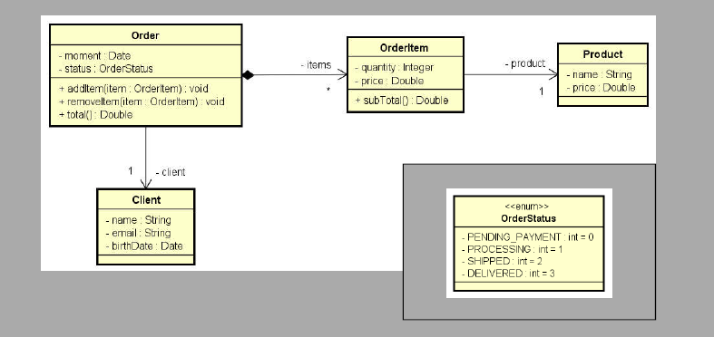
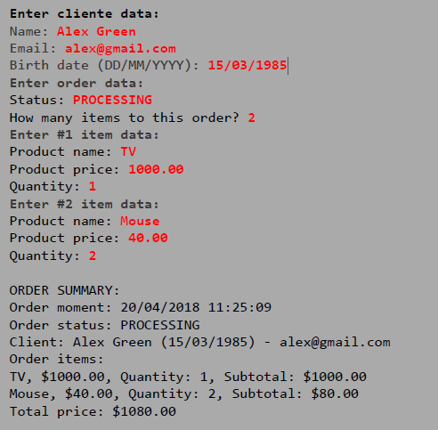

## Enunciado

## Sistema de gerenciamento de pedidos

Aplicação em Java desenvolvida para praticar POO, modelando um sistema de gerenciamento de pedidos.

O programa realiza a leitura dos dados de um cliente e de um pedido com vários itens, incluindo produtos, quantidades e preços, utilizando enums, composição entre classes e a API java.time . Ao final, é exibido um resumo completo do pedido com cálculo de subtotais e valor total.

exemplo de saída:
