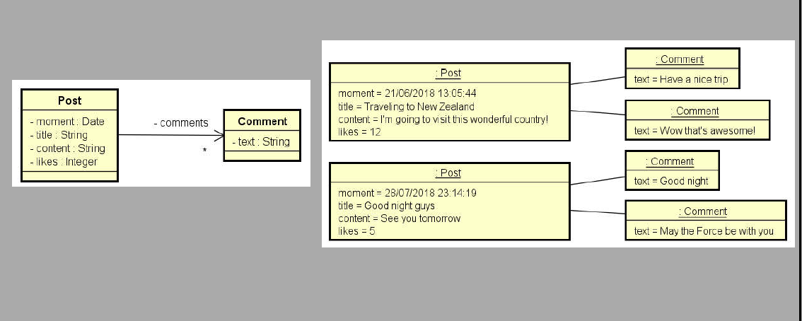

## Enunciado:

### Programa para cadastrar post de um rede social.

Desenvolver um programa em Java para cadastro e exibição de posts de uma rede social simples.

Cada post deve conter data e hora de criação, título, conteúdo, quantidade de likes e uma lista de comentários.

O programa deve permitir ao usuário cadastrar vários posts via entrada padrão, informar seus comentários e, ao final, exibir todos os posts
cadastrados com seus respectivos dados e comentários, utilizando listas e a API de datas do Java.

