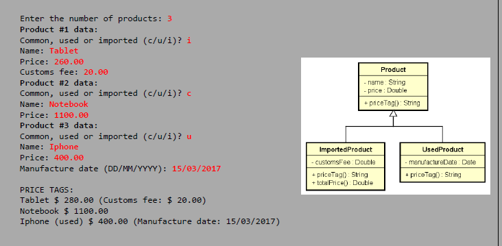

## Enunciado

### Programa para cadastrar produtos e mostrar a etiqueta de preço deles.

Criar um programa em Java que leia dados de vários produtos, podendo ser comuns, usados ou importados.
Cada tipo de produto possui regras próprias, e o programa deve usar herança e polimorfismo para calcular e exibir corretamente a etiqueta de preço (priceTag) de cada produto.

Exemplo de entrada e saída:
