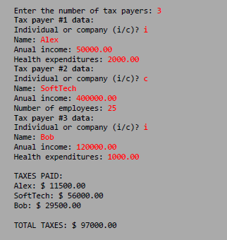
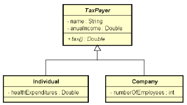

## Enunciado

### Projeto em Java desenvolvido para praticar POO, com foco em herança, polimorfismo e métodos abstratos.

O sistema lê dados de contribuintes (pessoa física e pessoa jurídica) e calcula o imposto de acordo com regras específicas para cada tipo.

Pessoa física: pessoas cuja renda foi abaixo de 20000.00 pagam 15% de imposto. Pessoas com renda de 20000.00 em diante pagam 25% de imposto. Se a pessoa teve gastos com saúde, 50% destes gastos são abatidos no imposto.

Empresas: empresas pagam 16% de imposto. Porém, se a empresa possuir mais de 10 funcionários, ela paga 14% de imposto.

Entrada e saída:

UML:
