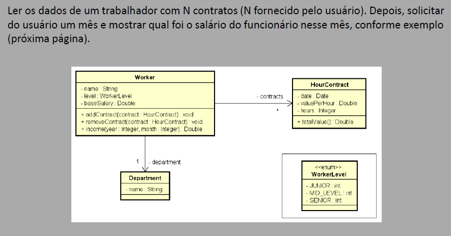

## Enunciado:

### Programa para cadastrar trabalhadores e seus contratos por hora, calculando o salário total com base em um mês e ano informados.

Ler os dados de um trabalhador com N contratos (N fornecido pelo usuário). Depois, solicitar
do usuário um mês e mostrar qual foi o salário do funcionário nesse mês, conforme exemplo

Exemplo de entrada e saída:

